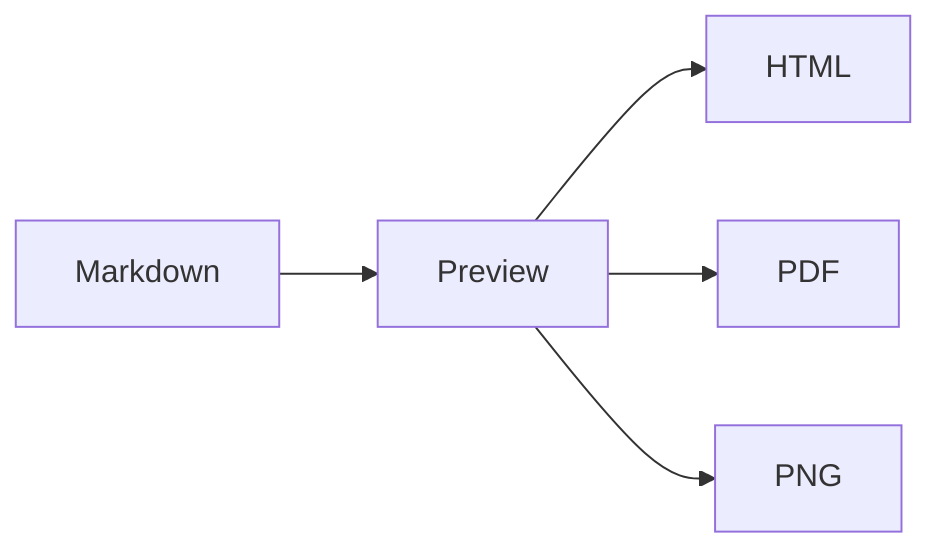

# Export Regression

This fixture exercises the self-contained HTML, continuous PNG, and paginated PDF exporters.

> [!NOTE]
> Exported alerts, links, emphasis, and **strong text** must retain their theme.

- [x] Render task state
- [ ] Preserve unchecked task state

| Feature | Status | Alignment |
| :--- | :---: | ---: |
| HTML | Ready | 100 |
| PDF | Ready | 100 |
| PNG | Ready | 100 |

## 十 数学公式

Inline math $E = mc^2$ and display math:

$$
\int_0^1 x^2\,dx = \frac{1}{3}
$$

## Diagram



## Wide code

```typescript
const intentionallyWideLine = ['TextMark', 'keeps', 'wide', 'code', 'readable', 'without', 'clipping'].join(' — ')
```

## Pagination

### A heading must stay with its following content

The exporter should avoid leaving this heading alone at the bottom of a PDF page. Repeated prose below gives the pagination engine enough material to exercise block boundaries.

TextMark renders Markdown locally and keeps exported artifacts self-contained. This paragraph is intentionally repeated to create stable multi-page output without external assets.

TextMark renders Markdown locally and keeps exported artifacts self-contained. This paragraph is intentionally repeated to create stable multi-page output without external assets.

TextMark renders Markdown locally and keeps exported artifacts self-contained. This paragraph is intentionally repeated to create stable multi-page output without external assets.
